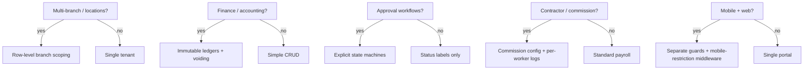

# Dev Discovery

A structured, 4-phase process that produces a comprehensive backend architecture blueprint from a Figma design, a merge/spec document, and a pre-existing boilerplate reference. **Every phase completes before the next begins.** The output is a chunked directory of markdown files — the canonical backend blueprint.

## When to Use

- "Do a dev discovery for this project"
- "Create the backend architecture / blueprint"
- "Design the database schema before we start coding"
- "Analyze the Figma design and merge doc to produce the backend structure"

Do NOT use for single-feature design (use brainstorming), API-only design without UI, or greenfield projects with no Figma or merge doc.

## Required Inputs

| Input | Why | How |
|---|---|---|
| Figma file URL + node IDs | Identifies the prototype | Extract from URL |
| Merge/spec document URL | Module specs, permissions, process flows | Google Sheets/Docs URL |
| Boilerplate `CONTEXT.md` | Conventions — loaded once, never re-extracted | Check boilerplate dir; create if missing |
| Target backend framework | Drives migration syntax, packages | Ask the user |

## Decision Tree

## Core Principle

**Bottom-up extraction, top-down design.** Extract every data field, module name, role, permission, and process flow from the source materials first. Then design the database and service architecture from those extracted facts. Never invent requirements. Never skip a module.

## Phases

### Phase 1: Gather — Extract All Source Materials in Parallel

**Boilerplate**: Check if `CONTEXT.md` exists. If yes, load it. If no, dispatch a one-time subagent to create it. Never re-explore.

**Dispatch these subagents in parallel** (use dispatching-parallel-agents):

| Subagent | Task |
|---|---|
| **Merge Doc Reader** | Read all tabs — scope, glossary, permissions, process flows, entity definitions |
| **Figma Analyzer** | Get full canvas metadata — extract unique page names, node IDs, variant counts |

**You do in parallel**: Load boilerplate CONTEXT.md, extract Figma design tokens, review any reference architecture doc.

**Completion criterion**: Both subagents returned. Design tokens extracted. Boilerplate conventions internalized.

### Phase 2: Analyze — Cross-Reference and Identify Gaps

1. **Extract Figma page inventory** — unique pages mapped to merge doc modules
2. **Sample key Figma pages** — `get_design_context` on one representative frame per page family (NOT all 90 variants)
3. **Build the module map** — cross-reference merge doc modules vs Figma pages. List gaps.
4. **Extract permission matrix** — structured `module → submodule → permission → roles`
5. **Extract process flows** — trigger, steps, state transitions, notifications
6. **Map design tokens** — Figma variables → Tailwind v4 `@theme`
7. **Internalize boilerplate conventions** — from CONTEXT.md

**Completion criterion**: Module map exists. Permissions extracted. Process flows enumerated. Design tokens mapped. Gaps documented.

### Phase 3: Design — Build the Complete Architecture

Design in dependency order (auth first, then core entities, then dependent modules).

For **every module** from the module map, produce:
- Full migration code (anonymous-class, `archives()` macro, proper FKs)
- Model class (traits, `casts()`, relationships, activity log)
- Status enums (`BackedEnum` + `BaseEnum` + `meta()`)
- FormRequest + Resource examples
- Service class (for modules with multi-step business logic — computation, approvals, state transitions)
- Permission names matching merge doc
- Mermaid state machine (if >2 statuses)
- UI elements extracted from Figma

Also design:
- Cross-cutting concerns (multi-tenancy, multi-portal, auth, storage, jobs)
- API contracts (routes, request/response, errors, rate limits)
- Permission catalogue (installable config array, both admin and portal guards)
- Migration order (numbered, dependency-ordered)
- ERD (Mermaid — master + per-domain islands)
- Process flows as code skeletons
- Open questions with default assumptions

**Completion criterion**: Every merge doc module has database tables + permissions. No module is "TBD."

### Phase 4: Document — Write and Review the Chunked Output

Produce a `docs/{project}/` directory. Structure: see `references/output-structure.md`.

**Review checklist**:
- Every merge doc module has database tables
- Every permission from matrix is in the catalogue
- Every process flow has a code skeleton
- All migrations follow boilerplate conventions
- All enums have `BaseEnum` + `meta()`
- No MySQL `enum()` — all status fields are `string` + PHP enum
- Design tokens extracted from Figma
- Open questions documented with defaults
- Dispatch a reviewer subagent for missing tables, RBAC gaps, state machine gaps

## Subagent Dispatch Strategy

- **Phase 1**: Two source-material subagents run in parallel while you load the boilerplate
- **Phase 2**: Use `explore` subagents to grep/read truncated tool output (never read 5MB+ files yourself). Use `general` subagents to call Figma `get_design_context` on key pages
- **Phase 3**: For large systems (15+ modules), write directly in phases (Foundation → Core → Extended → Cross-Cutting). For small systems (5-10 modules), a single subagent can handle it
- **Phase 4**: Run a reviewer subagent to find gaps. Subagents write; lead architect validates

## Common Mistakes

| Wrong | Right |
|---|---|
| "I got the main pages, let me start designing" | Verify every merge doc tab. Catalog every unique Figma page. |
| Writing migrations before extracting all UI fields | Complete Phase 2 entirely before Phase 3 |
| Using UUIDs when the boilerplate uses auto-increment | Follow boilerplate conventions verbatim |
| The Figma shows X, the merge doc says Y — skip Y | Merge doc is authoritative. Flag the gap as an open question |
| Making silent assumptions | Every assumption goes in Open Questions with a default |
| Calling `get_design_context` on all 90 page frames | One representative per page family |
| Re-exploring the boilerplate every session | CONTEXT.md is created once, referenced forever |
| One enormous markdown file | Chunk into `docs/{project}/` per `references/output-structure.md` |

## Quality Assurance Process

1. **Coverage check** — every merge doc module has entities, APIs, permissions, state machines
2. **Schema review** — grep for `Schema::create`; confirm every entity from the module map has a migration
3. **Permission audit** — every API endpoint has a permission; every permission in the RBAC matrix
4. **State machine alignment** — status values match migration defaults and data dictionary
5. **Subagent review** — dispatch a reviewer to find missing tables, unnormalized JSON, missing audit tables, finance immutability gaps, missing branch scoping
6. **Business handoff** — present blueprint with Assumptions & Risks table; every inference becomes a validation question

## References

Disclosed to separate files — loaded on demand:
- `references/source-materials.md` — Figma, Merge Doc, Boilerplate tool usage
- `references/diagram-templates.md` — Mermaid ERD, state machine, flowchart, route flow templates
- `references/output-structure.md` — Chunked docs pattern with examples
- `examples/dgt-hris.md` — Real output from a 15-module dental clinic HRIS discovery

## Cross-References

**REQUIRED**: `dispatching-parallel-agents` (Phase 1 and 2 depend on parallel subagent dispatch). `brainstorming` (if project scope is unclear, brainstorm first).

**Useful**: `codebase-search` (exploring unfamiliar boilerplates), `figma-tailwind-design-system` (extracting design tokens).
