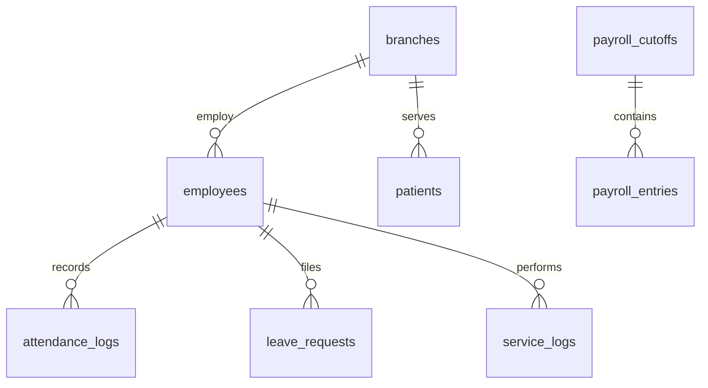
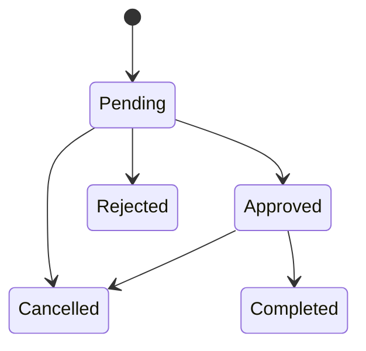
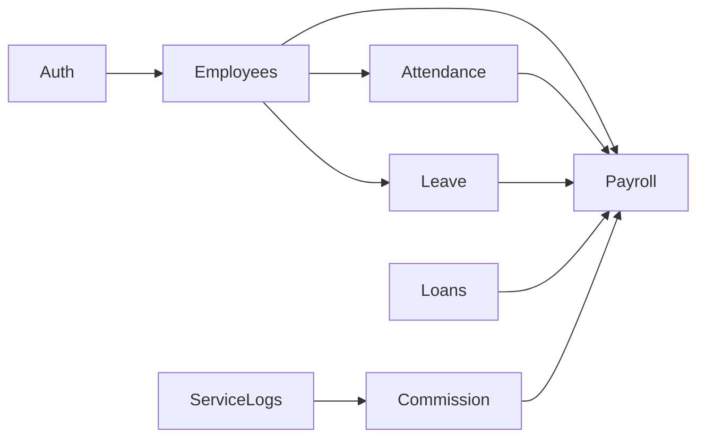
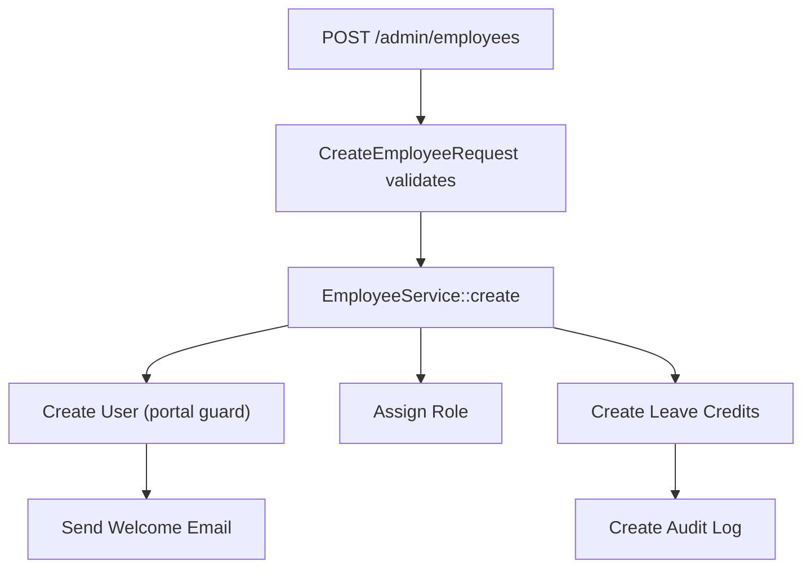
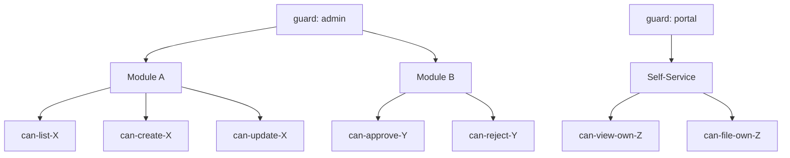

# Diagram Templates

Every dev discovery output MUST include rendered diagrams. Use **Mermaid** syntax (fenced with ` ```mermaid `) so diagrams render in GitHub, VS Code, and most markdown viewers.

## Entity Relationship Diagram



Include at module level and a master ERD in the final document.

## State Machine Diagram

Every entity with a `status` column that has more than 2 states MUST have a state machine:



Include allowed transitions, side effects (notifications, audit logs, balance updates).

## Module Dependency Flowchart



## Route / API Flow



## Permission Hierarchy



## Domain Islands (zoomed-in views)

For large systems, create focused ERDs for each domain island (auth, employment, payroll, assets) and link them from the master ERD.
